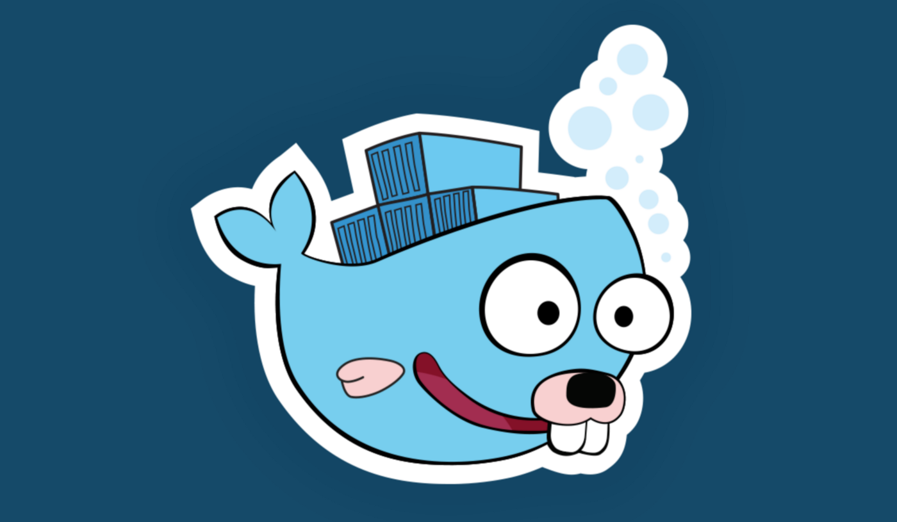

<p align="center">
	
</p>

<br />

<p align="center">
Example of using Test containers in Golang. <br />
Creating a Nats cluster with containers and test nats cluster with Golang SDK while running unit tests.
</p>

<br />

## What are test-containers?

Test-containers is a package that makes it simple to create and clean up container-based 
dependencies for automated _integration/smoke_ tests.

We use _test-containers_ to run our dependent services like databases in a container
hence we won't need to mock them or use real external services. This makes our uint tests more
efficient and more reliable.

The clean, easy-to-use API enables developers
to programmatically define containers that should 
be run as part of a test and clean up those 
resources when the test is done.

## Example

In the following example, we are going to create a **Nats**
container and test it.

```go
// container build request
req := testcontainers.ContainerRequest{
    Image:        "nats:latest",
    ExposedPorts: []string{"4222/tcp", "8222/tcp"},
    Cmd: []string{
        "--http_port 8222",
        "--cluster nats://0.0.0.0:6222",
        "--cluster_name NATS",
    },
    WaitingFor: wait.ForLog("Listening for client connections"),
}
```

The ```testcontainers.ContainerRequest``` describes how the Docker container will look.

- ```Image``` is the Docker image the container starts from.
- ```ExposedPorts``` lists the ports to be exposed from the container.
- ```Cmd``` is the commands that will be executed when container is set.
- ```WaitingFor``` is a field you can use to validate when a container is ready. It is important to get this set because it helps to know when the container is ready to receive any traffic. In this case, we check for the logs we know come from Redis, telling us that it is ready to accept requests.

When you use ExposedPorts you have to imagine 
yourself using ```docker run -p <port>```. 
When you do so, dockerd maps the selected ```<port>``` from 
inside the container to a random one available on your host.

```go
// building a generic container
container, err := testcontainers.GenericContainer(ctx, testcontainers.GenericContainerRequest{
    ContainerRequest: req,
    Started:          true,
})
```

```testcontainers.GenericContainer``` creates the 
container. 
In this example we are using ```Started: true```. 
It means that the container function will wait for 
the container to be up and running. 
If you set the Start value to false it won't start, 
leaving to you the decision about when to start it.

```go
// cleaning container after test is complete
t.Cleanup(func() {
    t.Log("terminating container")

    if er := container.Terminate(ctx); er != nil {
        t.Errorf("failed to terminate container: :%v", er)
    }
})
```

All the containers must be removed 
at some point, otherwise they will run until 
the host is overloaded. 
One of the ways we have to clean up is by deferring the terminated function: 
```defer container.Terminate(ctx)```.

## Talking to container

```go
// opening connection
nc, er := nats.Connect(container.URI)
if er != nil {
    t.Error(fmt.Errorf("connecting to nats container failed:\n\t%v\n", er))

    return
}

// async subscriber
go func() {
    _, e := nc.Subscribe(natsTopic, func(m *nats.Msg) {
        log.Printf("Received a message:\n\t%s\n", string(m.Data))
    })
    if e != nil {
        t.Error(fmt.Errorf("subscribe over topic failed:\n\t%v\n", e))
    }
}()

// publish over topic
if e := nc.Publish(natsTopic, []byte(natsValue)); e != nil {
    t.Error(fmt.Errorf("publish over topic failed:\n\t%v\n", e))
}
```

### Test

Run test with ```go test -v ./...``` command.
